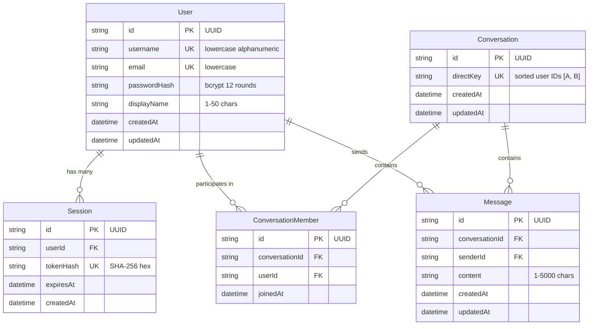

# System Architecture & Technical Specifications

> **Project**: `enctxt` (Private Chat)  
> **Current Version**: `0.1.0` (Phase 6 Complete)  
> **Last Updated**: 2026-08-26  
> **Status**: Maintained & Updated Continuously with System Changes

---

## 1. Architectural Philosophy: Multi-Layered Privacy

`enctxt` is architected around the principle of defense-in-depth, decoupling network/data storage security from physical screen exposure:

```text
┌───────────────────────────────────────────────────────────────────────────┐
│                     LAYER 2: VISUAL PRIVACY ENGINE                        │
│  - Protected Homoglyph Rendering on screen by default (Phase 5)           │
│  - Custom Multi-Step Gesture Sequence for temporary reveal (Phase 6)      │
│  - Automatic Re-Protection (8s timer, tab hide, window blur, nav, logout) │
└─────────────────────────────────────┬─────────────────────────────────────┘
                                      │
                                      ▼
┌───────────────────────────────────────────────────────────────────────────┐
│                   LAYER 1: CRYPTOGRAPHIC SECURITY (E2EE)                  │
│  - End-to-End Encryption across the wire and at rest (Phase 7)            │
│  - Device-level cryptographic key management & ratchets                   │
└─────────────────────────────────────┬─────────────────────────────────────┘
                                      │
                                      ▼
┌───────────────────────────────────────────────────────────────────────────┐
│                 TRANSPORT & AUTHORITATIVE SERVER INFRASTRUCTURE           │
│  - Session-based authentication & bcrypt password hashing (Phase 2)       │
│  - 1-to-1 conversation engine with deterministic pair keys (Phase 3)      │
│  - Real-Time WebSocket transport & PostgreSQL persistence (Phase 4)       │
└───────────────────────────────────────────────────────────────────────────┘
```

---

## 2. Monorepo Topology & Package Architecture

The codebase is organized as an npm workspaces monorepo with strict package boundaries:

```text
enctxt/
├── shared/                     # @enctxt/shared: Universal TypeScript types and DTOs
│   └── src/types/
│       ├── auth.ts             # Auth inputs, responses, session contracts
│       ├── user.ts             # User profiles, search summaries
│       ├── conversation.ts     # Conversation structures, participants
│       ├── message.ts          # Message models, delivery statuses
│       └── websocket.ts        # WebSocket client/server frame protocols
│
├── server/                     # @enctxt/server: Node.js + Express + Prisma + WebSocket
│   ├── src/
│   │   ├── config/             # Zod-validated environment variables
│   │   ├── controllers/        # Express HTTP route controllers
│   │   ├── middleware/         # Auth, rate limiting, error handling, logging
│   │   ├── routes/             # REST route declarations
│   │   ├── services/           # Business logic, DB operations, WebSocket server
│   │   └── utils/              # Crypto, JWT, Zod schemas, structured logger
│   ├── prisma/                 # Prisma PostgreSQL schema and migrations
│   └── test/                   # Vitest automated server integration tests
│
└── client/                     # @enctxt/client: React 18 + Vite + Tailwind CSS
    ├── src/
    │   ├── auth/               # AuthContext, session hooks, ProtectedRoute
    │   ├── components/         # UI components (Gesture, Messages, Layout)
    │   ├── hooks/              # useMessages, useGesture, useMessageReveal
    │   ├── pages/              # Landing, Login, Register, Dashboard, Chat
    │   ├── services/           # REST api client, WebSocket client manager
    │   └── utils/              # protectMessage, gesture normalization & recognizer
    └── test/                   # Vitest unit and privacy test suites
```

---

## 3. Database Architecture & PostgreSQL Schema

Data persistence is managed through Prisma ORM targeting PostgreSQL.



### Relational Constraints & Indexing Strategy
1. **Direct Pair Determinism**: `Conversation.directKey` (`[userA, userB].sort().join(':')`) guarantees exact $O(1)$ uniqueness and eliminates duplicate conversations or race conditions.
2. **Membership Uniqueness**: `@@unique([conversationId, userId])` on `ConversationMember`.
3. **Optimized Chronological Queries**: `@@index([conversationId, createdAt])` on `Message` enables ultra-fast cursor pagination.
4. **Cascade Deletion**: User/Conversation removal cascades cleanly to members, sessions, and messages.

---

## 4. Subsystem Specifications

### 4.1. Authentication & Session Subsystem (Phase 2)
- **Password Security**: Passwords hashed with `bcrypt` (12 salt rounds). Plaintext passwords never stored, cached, or logged.
- **Session Tokens**: 32-byte cryptographically secure random values signed in JWT payloads. Only the SHA-256 hash (`tokenHash`) is persisted in the database.
- **Cookie Security**:
  - `HttpOnly`: Inaccessible to JavaScript `document.cookie` (mitigates XSS token theft).
  - `SameSite=lax`: Mitigates cross-site request forgery (CSRF).
  - `Secure`: Set to `true` automatically in production over HTTPS.
- **Rate Limiting**: In-memory IP-based rate limiting on authentication endpoints (5 requests/minute).

### 4.2. 1-to-1 Conversation Engine (Phase 3)
- **Idempotent Creation**: `POST /api/conversations` creates a new conversation or retrieves the existing conversation between the two users.
- **Strict Authorization**: `ConversationController` and `ConversationService` verify caller membership before allowing single conversation retrieval or message queries (`403 Forbidden` on unauthorized access).

### 4.3. Real-Time Messaging & WebSocket Subsystem (Phase 4)
- **Transport**: Native WebSocket server (`ws`) mounted alongside Express HTTP server at `/ws`.
- **Handshake Authentication**: Evaluates `enctxt_session` cookie directly from HTTP upgrade request headers (or late `auth` message frame).
- **Multi-Session Routing**: Tracks active sockets via `Map<userId, Set<WebSocket>>`, allowing a user to maintain multiple active tabs/devices simultaneously.
- **Cursor-Based Pagination**: `GET /api/conversations/:id/messages?limit=50&before=<messageId>` fetches historical messages in deterministic reverse-chronological slices, returned in chronological ascending order for immediate UI rendering.
- **Reconnection Resilience**: Client implements exponential backoff (`1s` $\to$ `2s` $\to$ `4s` $\to$ `10s`) and automatically synchronizes missed messages via REST upon reconnection.

### 4.4. Visual Privacy Engine — Layer 2 (Phase 5)
- **Purpose**: Prevents casual shoulder-surfing and visual exposure on screen without altering underlying message state or transport data.
- **Deterministic Transformation Algorithm (`protectMessage`)**:
  - Pure mathematical function with zero side effects.
  - Maps uppercase Latin characters (`A` $\to$ `Λ`, `B` $\to$ `Β`, `D` $\to$ `Δ`, `E` $\to$ `Є`, etc.) and lowercase Latin characters (`a` $\to$ `α`, `e` $\to$ `є`, `o` $\to$ `σ`, etc.) to visual homoglyphs.
  - Preserves word boundaries, whitespace (`\n`, `\t`), punctuation (`?`, `!`, `.`), numbers (`0-9`), and international scripts (Devanagari, CJK, etc.).
  - Code-point iteration (`for...of`) guarantees multi-byte emoji surrogate pairs (`😊`, `🚀`, `👋`) are never split or corrupted.
- **`<ProtectedMessage>` Component**:
  - Memoized via `React.memo` and `useMemo` for zero re-computation overhead on scroll.
  - Accessible container (`aria-label="Protected message"`).
  - Prepared with `displayMode?: 'protected' | 'revealed'` to support seamless Phase 6 reveal transitions.

### 4.5. Custom Gesture Reveal System — Layer 2 (Phase 6)
- **Local Reveal Authorization**:
  - The gesture sequence is a local display authorization mechanism. It is **NOT** an encryption key, password, or authentication token.
  - **Zero Server Transmission**: Raw coordinates, normalized templates, similarity metrics, and reveal states are **strictly local to the client browser** (`localStorage` v1) and are **never** transmitted to the server or over WebSockets.
- **Geometric Normalization Pipeline (`gestureNormalize.ts`)**:
  1. *Stroke Validation*: Rejects accidental taps and jitter ($< 30\text{px}$ path length).
  2. *Equidistant Resampling*: Resamples path into exactly $N = 64$ equidistant points along cumulative arc length.
  3. *Centroid Translation*: Translates centroid $(\bar{x}, \bar{y})$ to $(0, 0)$ for translation invariance.
  4. *Bounding Box Scaling*: Scales proportionally to standard $100 \times 100$ bounding box for scale invariance.
  5. *Direction Preservation*: Retains stroke draw order.
- **Geometric Distance Recognizer (`gestureRecognizer.ts`)**:
  - Computes average Euclidean point-to-point distance:
    $$D = \frac{1}{N} \sum_{i=1}^N \sqrt{(x_{A,i} - x_{B,i})^2 + (y_{A,i} - y_{B,i})^2}$$
  - Matching threshold: $D \le 28.0$ (or similarity score $\ge 0.72$).
  - Tolerates natural drawing variations while strictly rejecting different geometric shapes (circle vs triangle vs line vs square) and reversed stroke directions.
- **Interactive UI & Re-Protection Lifecycle (`useMessageReveal.ts`)**:
  - *Multi-Step Enrollment*: 2 to 5 gestures (default 3) with mandatory confirmation step.
  - *Temporary Reveal*: Correct sequence reveals only the targeted message for 8 seconds.
  - *5-Strike Lockout*: 5 consecutive failed attempts trigger a 30-second cooldown timer.
  - *Auto Re-Protection Triggers*:
    - 8-second countdown timer expiration
    - Tab switch (`document.visibilityState === 'hidden'`)
    - Window blur (`window.blur`)
    - Navigation away from conversation
    - User logout

---

## 5. Security & Privacy Audit Matrix

| Security / Privacy Control | Implementation | Verification Status |
|---|---|---|
| **Password Storage** | One-way `bcrypt` hashing (12 rounds) | Verified (55/55 backend tests) |
| **Session Protection** | `HttpOnly`, `SameSite=lax`, `Secure` cookies | Verified |
| **Direct Conversation Key** | Deterministic sorting `[A, B].sort().join(':')` | Verified |
| **Cross-Tenant Authorization** | Non-members blocked with `403 Forbidden` | Verified |
| **Message Redaction in Logs** | `logger.ts` redacts passwords, tokens, message content, gesture data | Verified |
| **Visual Message Protection** | Deterministic visual homoglyph substitution | Verified (17/17 protectMessage tests) |
| **Gesture Privacy** | Local-only browser storage (`localStorage`), zero server traffic | Verified (22/22 gesture tests) |
| **Auto Re-Protection** | Timers, visibility change, blur, navigation, logout | Verified |

---

## 6. Architecture Evolution & Changelog

| Phase | Title | Major Architectural Additions |
|---|---|---|
| **Phase 1** | Project Foundation | Monorepo structure, Express API, Prisma integration, Tailwind CSS, health check |
| **Phase 2** | Authentication & User Identity | `User` and `Session` models, bcrypt hashing, JWT cookies, rate limiting, user search |
| **Phase 3** | 1-to-1 Conversations | `Conversation` and `ConversationMember` models, direct pair keys, membership authorization |
| **Phase 4** | Real-Time Messaging | `Message` model, cursor pagination, WebSocket server `/ws`, multi-session routing, live chat UI |
| **Phase 5** | Protected Message Rendering | Visual privacy engine (`protectMessage`), `<ProtectedMessage>` component, zero visual plaintext |
| **Phase 6** | Custom Gesture Reveal System | Geometric normalization (64-point resample), Euclidean recognizer, `GestureCanvas`, local storage, 8s reveal timer, auto re-protection, 5-strike lockout |
| **Phase 7** | End-to-End Encryption (Layer 1) | *(Planned)* Cryptographic key generation, Double Ratchet / Signal protocol, client-side encryption/decryption |
| **Phase 8** | Multi-Client & Mobile Support | *(Planned)* Android client, push notifications architecture |

---

*This document is maintained as the authoritative architectural record for the enctxt codebase.*
