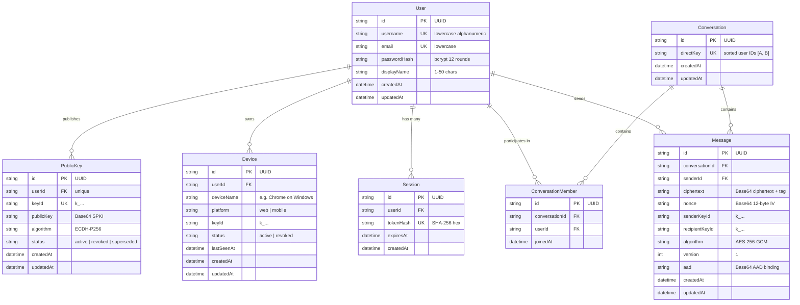

# System Architecture & Technical Specifications

> **Project**: `enctxt` (Private Chat)  
> **Current Version**: `0.1.0` (Phases 1–8 Complete)  
> **Last Updated**: 2026-08-26  
> **Status**: Maintained & Updated Continuously with System Changes

---

## 1. Architectural Philosophy: Multi-Layered Privacy (Defense-in-Depth)

`enctxt` is architected around 4 distinct, decoupled privacy and security layers, ensuring that server compromise, network eavesdropping, shoulder surfing, and public-key substitution are handled independently:

```text
┌───────────────────────────────────────────────────────────────────────────┐
│                     LAYER 4: IDENTITY VERIFICATION                        │
│  - Public-Key Fingerprints (SHA-256 SPKI hex blocks: A7D4 92F1 8C20...)    │
│  - Symmetric Safety Numbers: SHA-256(min(A, B) + max(A, B) + v1)          │
│  - Key-Change Detection & In-App Security Warnings                        │
│  - Local-Only Contact Verification Storage (IndexedDB / localStorage)     │
│  - Problem Solved: "Whom am I cryptographically communicating with?"      │
└─────────────────────────────────────┬─────────────────────────────────────┘
                                      │
                                      ▼
┌───────────────────────────────────────────────────────────────────────────┐
│                 LAYER 3: CUSTOM GESTURE REVEAL (PHASE 6)                  │
│  - User-defined multi-stroke geometric unistroke gesture sequences        │
│  - 64-point equidistant arc-length resampling + Euclidean recognizer      │
│  - 8-second temporary plaintext reveal authorization                      │
│  - Auto Re-Protection on timer, tab hide, blur, navigation, and logout    │
│  - 5-strike lockout protection (30-second cooldown)                       │
│  - Problem Solved: "Who can see plaintext on my screen right now?"        │
└─────────────────────────────────────┬─────────────────────────────────────┘
                                      │
                                      ▼
┌───────────────────────────────────────────────────────────────────────────┐
│             LAYER 2: PROTECTED MESSAGE RENDERING (PHASE 5)                │
│  - Deterministic lookalike visual homoglyphs on screen by default         │
│  - Preserves layout, word length, whitespace, emojis, and punctuation    │
│  - Zero plaintext in the DOM tree by default                              │
│  - Problem Solved: "Can someone glancing at my screen read my messages?"  │
└─────────────────────────────────────┬─────────────────────────────────────┘
                                      │
                                      ▼
┌───────────────────────────────────────────────────────────────────────────┐
│               LAYER 1: END-TO-END ENCRYPTION (PHASE 7 & 8)                │
│  - Native Web Crypto ECDH (P-256 / secp256r1) Identity Key Agreement      │
│  - HKDF-SHA-256 Symmetric Conversation Key Derivation (256-bit AES)       │
│  - AES-256-GCM Authenticated Encryption with 128-bit Tag & AAD Context    │
│  - Protocol Versioning (v1) & Strict Algorithm Allowlist (Downgrade Def) │
│  - Non-extractable client-side private keys stored in local IndexedDB     │
│  - PostgreSQL & WebSockets transport and store ciphertext envelopes ONLY  │
│  - Problem Solved: "Can the server, network, or database read messages?"  │
└─────────────────────────────────────┬─────────────────────────────────────┘
                                      │
                                      ▼
┌───────────────────────────────────────────────────────────────────────────┐
│                 TRANSPORT & AUTHORITATIVE SERVER INFRASTRUCTURE           │
│  - Session-based authentication & bcrypt password hashing (12 rounds)     │
│  - 1-to-1 conversation engine with deterministic sorted pair keys         │
│  - Real-Time WebSocket transport & PostgreSQL persistence (/ws)           │
│  - Public Key Infrastructure & Device Trust Management (Phases 7 & 8)     │
│  - HTTP Security Headers: CSP, HSTS, X-Content-Type-Options, Referrer     │
└───────────────────────────────────────────────────────────────────────────┘
```

---

## 2. Monorepo Topology & Package Architecture

The codebase is organized as an npm workspaces monorepo with strict package boundaries:

```text
enctxt/
├── shared/                     # @enctxt/shared: Universal TypeScript types and DTOs
│   └── src/types/
│       ├── api.ts              # API error models & generic responses
│       ├── auth.ts             # Auth inputs, responses, session contracts
│       ├── user.ts             # User profiles, search summaries
│       ├── conversation.ts     # Conversation structures, participants
│       ├── message.ts          # Encrypted message models, delivery statuses
│       ├── websocket.ts        # WebSocket client/server frame protocols
│       └── crypto.ts           # Encrypted envelopes, PKI DTOs, verification & device types
│
├── server/                     # @enctxt/server: Node.js + Express + Prisma + WebSocket
│   ├── src/
│   │   ├── config/             # Zod-validated environment variables
│   │   ├── controllers/        # Express HTTP route controllers (Auth, User, Conv, Message, Crypto, Device)
│   │   ├── middleware/         # Auth, rate limiting, error handling, logging, securityHeaders
│   │   ├── routes/             # REST route declarations (/api/auth, /api/users, /api/conversations, /api/crypto, /api/devices)
│   │   ├── services/           # Business logic, DB operations, WebSocket server, Crypto PKI, DeviceService
│   │   └── utils/              # Crypto, JWT, Zod schemas, structured logger
│   ├── prisma/                 # Prisma PostgreSQL schema (User, PublicKey, Device, Session, Conversation, Message)
│   └── test/                   # Vitest automated server integration tests (Auth, Conv, Message, WS, Crypto, Device, SecurityHeaders)
│
└── client/                     # @enctxt/client: React 18 + Vite + Tailwind CSS
    ├── src/
    │   ├── auth/               # AuthContext, session hooks, ProtectedRoute
    │   ├── components/         # UI components (Gesture, Messages, Security, Layout)
    │   ├── crypto/             # Web Crypto keyManager, keyExchange, encryption, decryption, fingerprint, safetyNumber, verificationStorage
    │   ├── hooks/              # useMessages (E2EE), useContactSecurity, useGesture, useMessageReveal
    │   ├── pages/              # Landing, Login, Register, Dashboard, ConversationPage
    │   ├── services/           # REST api client, WebSocket client manager
    │   └── utils/              # protectMessage, gesture normalization & recognizer
    └── test/                   # Vitest unit and privacy test suites (protectMessage, gesture, sequence, crypto, verification)
```

---

## 3. Database Architecture & PostgreSQL Schema

Data persistence is managed through Prisma ORM targeting PostgreSQL.



---

## 4. Cryptographic Protocol & Message Flow

### 4.1. End-to-End Encryption Wire Envelope (`EncryptedMessageEnvelope`)

```json
{
  "version": 1,
  "algorithm": "AES-256-GCM",
  "keyAgreement": "ECDH-P256",
  "senderKeyId": "k_e0f0a460d44c40968a7f7ed2ee3b5fd2",
  "recipientKeyId": "k_0e736526c27640a7bd91082eb5780a06",
  "nonce": "dGhpcyBpcyBhIDEyLWJ5dGUgbm9uY2U=",
  "ciphertext": "Y2lwaGVydGV4dCB3aXRoIDE2LWJ5dGUgZ2NtIHRhZw==",
  "aad": "Y29udGV4dF9hYWRfc3RyaW5n"
}
```

### 4.2. Mathematical Key Agreement & Context Binding

1. **Identity Key Generation (Client-Side)**:
   - Curve: NIST `P-256` (`secp256r1`).
   - $\text{Priv}_A, \text{Pub}_A \leftarrow \text{GenerateKeyPair}(\text{ECDH})$.
   - $\text{Priv}_A$ stored in client `IndexedDB` (`enctxt_crypto_db`). $\text{Pub}_A$ exported as Base64 SPKI.
2. **Symmetric Conversation Key Agreement**:
   - Shared secret: $Z = \text{ECDH}(\text{Priv}_A, \text{Pub}_B) \equiv \text{ECDH}(\text{Priv}_B, \text{Pub}_A)$.
   - 256-bit symmetric conversation key:
     $$\text{ConvKey} = \text{HKDF}(\text{IKM}=Z, \text{salt}=\text{conversationId}, \text{info}=\text{"enctxt-v1-e2ee"}, \text{length}=256)$$
3. **Authenticated Associated Data (AAD)**:
   - $\text{AAD} = \text{UTF8}(\text{conversationId} + ":" + \text{senderId} + ":\text{v" + version})$.
   - AES-256-GCM 128-bit authentication tag guarantees ciphertext cannot be transplanted into another conversation or forged by an unauthorized sender.

---

## 5. Subsystem Specifications

### 5.1. Identity Verification & Safety Numbers — Layer 4 (Phase 8)
- **Public Key Fingerprint**: Deterministic SHA-256 hash of canonical SPKI bytes formatted in 8 groups of 4 hex characters (`A7D4 92F1 8C20 4E73 19AB 63D0 7F2A 91CC`).
- **Symmetric Safety Numbers**:
  - Derived from $\text{SHA-256}(\min(K_A, K_B) + ":" + \max(K_A, K_B) + ":\text{v1"})$.
  - Formatted into four 5-digit decimal blocks (`48321 72904 18273 66421`).
  - Symmetric for both participants.
- **Key Change Detection State Machine**:
  ```text
  [ UNVERIFIED ] ──(User marks as verified)──> [ VERIFIED ]
         ▲                                           │
         │                                           │ (Peer key rotates)
         │                                           ▼
  [ REVERIFY ] <──(Review new safety number)─── [ KEY_CHANGED (Warning Banner) ]
  ```
- **Local Verification Storage**:
  - Saved in browser storage under `enctxt_verified_contacts_v1` bound to `{ userId, keyId, fingerprint, verifiedAt }`.
  - Corrupted storage fails closed to `unverified`.

### 5.2. Device Trust & Session Management — Phase 8
- **Device Model & Endpoints**:
  - `GET /api/devices`: List all registered devices for authenticated user.
  - `POST /api/devices/register`: Registers a device identity with device name, platform, and active `keyId`.
  - `POST /api/devices/:id/revoke`: Revokes a device. Unauthorized attempts rejected with `403 Forbidden`.
- **Session vs. Device Separation**: Session expiration or logout does not destroy long-term device cryptographic keys.

### 5.3. Custom Gesture Reveal System — Layer 3 (Phase 6)
- **Geometric Normalization Pipeline**:
  1. Equidistant arc-length resampling ($N = 64$ points).
  2. Centroid translation to origin $(0, 0)$.
  3. Non-uniform bounding box scaling to reference square ($100 \times 100$).
- **Euclidean Recognizer**: Average Euclidean distance threshold ($D \le 28.0$).
- **Multi-Step Sequences**: 2–5 sequential unistroke gestures.
- **Lockout Security**: 5 consecutive failed attempts trigger a 30-second lockout.
- **Automatic Re-Protection**: Revealed messages return to protected homoglyphs after 8 seconds, or immediately upon `document.visibilityState === 'hidden'`, window blur, navigation, or logout.

### 5.4. Visual Privacy Engine — Layer 2 (Phase 5)
- **Deterministic Homoglyphs (`protectMessage`)**:
  - Maps Latin characters to visually similar Unicode homoglyphs.
  - Retains character count, word spacing, punctuation, numbers, and emojis.
  - Zero plaintext in the DOM by default.

### 5.5. Authoritative Transport & Server (Phases 1–4)
- **Authentication**: `bcryptjs` (12 salt rounds), JWT in `HttpOnly`/`SameSite=lax`/`Secure` cookies.
- **1-to-1 Conversations**: Idempotent creation via deterministic sorted pair keys (`[idA, idB].sort().join(':')`). Non-members blocked with `403 Forbidden`.
- **Real-Time WebSockets**: Mounted at `/ws`, heartbeat ping/pong every 30s, multi-session user routing, cursor-based pagination.
- **HTTP Security Headers**: `Content-Security-Policy`, `X-Content-Type-Options: nosniff`, `X-Frame-Options: DENY`, `Referrer-Policy: strict-origin-when-cross-origin`, `Permissions-Policy: camera=(), microphone=(), geolocation=()`, `Strict-Transport-Security`.

---

## 6. Complete API Endpoint Catalog

| Method | Endpoint | Description | Auth Required |
|---|---|---|---|
| `GET` | `/api/health` | System and PostgreSQL database connectivity check | No |
| `POST` | `/api/auth/register` | Register new user account, hash password with bcrypt | No (Rate Limited) |
| `POST` | `/api/auth/login` | Authenticate user, issue HttpOnly JWT session cookie | No (Rate Limited) |
| `GET` | `/api/auth/me` | Retrieve current authenticated user profile | No |
| `POST` | `/api/auth/logout` | Invalidate active session in DB, clear cookie | No |
| `GET` | `/api/users/me` | Get detailed user profile | Yes |
| `PATCH` | `/api/users/me` | Update display name and/or username | Yes |
| `GET` | `/api/users/search?q=<query>` | Search registered users by username/name | Yes |
| `POST` | `/api/crypto/identity` | Publish or rotate user's ECDH public identity key | Yes |
| `GET` | `/api/crypto/users/:userId/key` | Retrieve public key for target user | Yes |
| `GET` | `/api/devices` | List registered devices belonging to authenticated user | Yes |
| `POST` | `/api/devices/register` | Register new client device identity | Yes |
| `POST` | `/api/devices/:id/revoke` | Revoke a registered device (owner only) | Yes |
| `POST` | `/api/conversations` | Create or fetch existing 1-to-1 conversation | Yes |
| `GET` | `/api/conversations` | List active conversations with pagination | Yes |
| `GET` | `/api/conversations/:id` | Get conversation metadata (members only) | Yes |
| `POST` | `/api/conversations/:id/messages` | Send encrypted envelope (stores ciphertext, emits WS event) | Yes |
| `GET` | `/api/conversations/:id/messages` | Retrieve encrypted message history with cursor pagination | Yes |
| `POST` | `/api/conversations/:id/read` | Mark conversation read & emit read receipt | Yes |
| `WS` | `/ws` | Real-time WebSocket connection for message events | Cookie / Auth Frame |

---

## 7. Security & Privacy Audit Matrix

| Security / Privacy Control | Implementation | Verification Status |
|---|---|---|
| **Identity Verification** | SHA-256 fingerprint & symmetric safety numbers | Verified (8/8 verification tests) |
| **Key-Change Detection** | Local verification binding to exact keyId | Verified |
| **Algorithm Downgrade Defense** | Strict allowlist for v1/AES-GCM/ECDH | Verified |
| **Device Trust & Revocation** | Authorized device listing & revoke endpoints | Verified (6/6 device tests) |
| **HTTP Security Headers** | CSP, HSTS, X-Content-Type-Options, Referrer, Permissions | Verified (5/5 header tests) |
| **E2EE Message Confidentiality** | Client-side AES-256-GCM + ECDH P-256 | Verified (14/14 crypto tests) |
| **Server Plaintext Isolation** | Ciphertext-only in DB, REST, WebSockets, and logs | Verified (13/13 message tests, 8/8 WS tests) |
| **Visual Message Protection** | Deterministic homoglyphs by default | Verified (17/17 protectMessage tests) |
| **Gesture Authorization** | Local-only browser storage (`localStorage`) | Verified (22/22 gesture tests) |
| **Password Storage** | `bcrypt` (12 rounds) | Verified (20/20 auth tests) |

---

## 8. Architecture Evolution & Changelog

| Phase | Title | Major Architectural Additions |
|---|---|---|
| **Phase 1** | Project Foundation | Monorepo structure, Express API, Prisma integration, Tailwind CSS, health check |
| **Phase 2** | Authentication & User Identity | `User` and `Session` models, bcrypt hashing, JWT cookies, rate limiting, user search |
| **Phase 3** | 1-to-1 Conversations | `Conversation` and `ConversationMember` models, direct pair keys, membership authorization |
| **Phase 4** | Real-Time Messaging | `Message` model, cursor pagination, WebSocket server `/ws`, multi-session routing, live chat UI |
| **Phase 5** | Protected Message Rendering | Visual privacy engine (`protectMessage`), `<ProtectedMessage>` component, zero visual plaintext |
| **Phase 6** | Custom Gesture Reveal System | Geometric normalization (64-point resample), Euclidean recognizer, `GestureCanvas`, local storage, 8s reveal timer, auto re-protection, 5-strike lockout |
| **Phase 7** | End-to-End Encryption (Layer 1) | Web Crypto ECDH (P-256) identity keys, HKDF-SHA-256 conversation keys, AES-256-GCM AEAD encryption with AAD, `PublicKey` model & distribution API, encrypted message envelopes, zero plaintext on server |
| **Phase 8** | Security Hardening & Trust | Public key fingerprints, symmetric safety numbers, key-change detection and warnings, device trust and revocation API, protocol downgrade and replay protection, HTTP security headers (CSP, HSTS) |

---

*This document is maintained as the authoritative architectural record for the enctxt codebase.*
