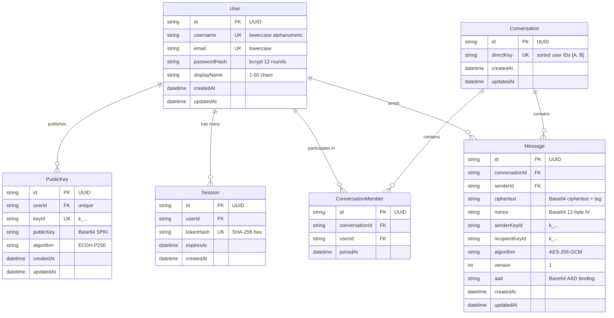

# System Architecture & Technical Specifications

> **Project**: `enctxt` (Private Chat)  
> **Current Version**: `0.1.0` (Phase 7 Complete)  
> **Last Updated**: 2026-08-26  
> **Status**: Maintained & Updated Continuously with System Changes

---

## 1. Architectural Philosophy: Multi-Layered Privacy

`enctxt` is architected around the principle of defense-in-depth, decoupling network/data storage security from physical screen exposure:

```text
┌───────────────────────────────────────────────────────────────────────────┐
│                     LAYER 2: VISUAL PRIVACY ENGINE                        │
│  - Protected Homoglyph Rendering on screen by default (Phase 5)           │
│  - Custom Multi-Step Gesture Sequence for temporary reveal (Phase 6)      │
│  - Automatic Re-Protection (8s timer, tab hide, window blur, nav, logout) │
└─────────────────────────────────────┬─────────────────────────────────────┘
                                      │
                                      ▼
┌───────────────────────────────────────────────────────────────────────────┐
│                   LAYER 1: CRYPTOGRAPHIC SECURITY (E2EE)                  │
│  - Web Crypto ECDH (P-256) Identity Key Agreement (Phase 7)               │
│  - HKDF-SHA-256 Symmetric Conversation Key Derivation (Phase 7)           │
│  - AES-256-GCM Authenticated Encryption with 128-bit Tag & AAD (Phase 7)  │
│  - Zero Plaintext on Server (PostgreSQL stores ciphertext envelopes only) │
└─────────────────────────────────────┬─────────────────────────────────────┘
                                      │
                                      ▼
┌───────────────────────────────────────────────────────────────────────────┐
│                 TRANSPORT & AUTHORITATIVE SERVER INFRASTRUCTURE           │
│  - Session-based authentication & bcrypt password hashing (Phase 2)       │
│  - 1-to-1 conversation engine with deterministic pair keys (Phase 3)      │
│  - Real-Time WebSocket transport & PostgreSQL persistence (Phase 4)       │
│  - Public Key Infrastructure & Distribution API (Phase 7)                 │
└───────────────────────────────────────────────────────────────────────────┘
```

---

## 2. Monorepo Topology & Package Architecture

The codebase is organized as an npm workspaces monorepo with strict package boundaries:

```text
enctxt/
├── shared/                     # @enctxt/shared: Universal TypeScript types and DTOs
│   └── src/types/
│       ├── api.ts              # API error models & generic responses
│       ├── auth.ts             # Auth inputs, responses, session contracts
│       ├── user.ts             # User profiles, search summaries
│       ├── conversation.ts     # Conversation structures, participants
│       ├── message.ts          # Encrypted message models, delivery statuses
│       ├── websocket.ts        # WebSocket client/server frame protocols
│       └── crypto.ts           # Encrypted envelopes, PKI DTOs
│
├── server/                     # @enctxt/server: Node.js + Express + Prisma + WebSocket
│   ├── src/
│   │   ├── config/             # Zod-validated environment variables
│   │   ├── controllers/        # Express HTTP route controllers (Auth, User, Conv, Message, Crypto)
│   │   ├── middleware/         # Auth, rate limiting, error handling, logging
│   │   ├── routes/             # REST route declarations (/api/auth, /api/users, /api/conversations, /api/crypto)
│   │   ├── services/           # Business logic, DB operations, WebSocket server, Crypto PKI
│   │   └── utils/              # Crypto, JWT, Zod schemas, structured logger
│   ├── prisma/                 # Prisma PostgreSQL schema (User, PublicKey, Session, Conversation, Message)
│   └── test/                   # Vitest automated server integration tests (Auth, Conv, Message, WS, Crypto)
│
└── client/                     # @enctxt/client: React 18 + Vite + Tailwind CSS
    ├── src/
    │   ├── auth/               # AuthContext, session hooks, ProtectedRoute
    │   ├── components/         # UI components (Gesture, Messages, Layout)
    │   ├── crypto/             # Web Crypto keyManager, keyExchange, encryption, decryption, cryptoStorage
    │   ├── hooks/              # useMessages (E2EE), useGesture, useMessageReveal
    │   ├── pages/              # Landing, Login, Register, Dashboard, ConversationPage
    │   ├── services/           # REST api client, WebSocket client manager
    │   └── utils/              # protectMessage, gesture normalization & recognizer
    └── test/                   # Vitest unit and privacy test suites (protectMessage, gesture, sequence, crypto)
```

---

## 3. Database Architecture & PostgreSQL Schema

Data persistence is managed through Prisma ORM targeting PostgreSQL.



---

## 4. Subsystem Specifications

### 4.1. End-to-End Encryption — Layer 1 (Phase 7)
- **Zero Plaintext on Server**: All messages are encrypted locally on the sender's device using native Web Crypto APIs before transmission.
- **Identity & Key Agreement**:
  - Each client generates an ECDH keypair on NIST curve P-256 (`secp256r1`).
  - Private key is stored locally in client `IndexedDB` (`enctxt_crypto_db`) and **never transmitted**.
  - Public key is exported as Base64 SPKI and published via `POST /api/crypto/identity`.
- **Key Derivation (KDF)**:
  - Shared secret: $Z = \text{ECDH}(\text{Priv}_A, \text{Pub}_B) \equiv \text{ECDH}(\text{Priv}_B, \text{Pub}_A)$.
  - 256-bit symmetric conversation key: $\text{Key} = \text{HKDF}(\text{IKM}=Z, \text{salt}=\text{conversationId}, \text{info}=\text{"enctxt-v1-e2ee"})$.
- **Authenticated Encryption (AEAD)**:
  - Algorithm: `AES-256-GCM` with a 128-bit authentication tag.
  - Nonce/IV: 96-bit (12-byte) cryptographically secure random value freshly generated per message.
  - Authenticated Associated Data (AAD): Context-bound to `${conversationId}:${senderId}:v1`, preventing ciphertext splicing.
- **Envelope Wire Format**:
  ```json
  {
    "version": 1,
    "algorithm": "AES-256-GCM",
    "keyAgreement": "ECDH-P256",
    "senderKeyId": "k_...",
    "recipientKeyId": "k_...",
    "nonce": "Base64 (12 bytes)",
    "ciphertext": "Base64 (payload + tag)",
    "aad": "Base64"
  }
  ```

### 4.2. Visual Privacy Engine & Gesture Reveals — Layer 2 (Phases 5 & 6)
- **Deterministic Visual Homoglyphs (`protectMessage`)**:
  - Replaces Latin characters with lookalike visual homoglyphs on screen by default.
  - Preserves word lengths, whitespace, numbers, punctuation, and multi-byte emojis.
- **Custom Gesture Reveal System**:
  - 64-point normalized equidistant resampling, centroid translation to $(0, 0)$, $100 \times 100$ bounding box scaling.
  - Average Euclidean point distance recognizer ($D \le 28.0$).
  - Multi-step gesture sequence (2-5 steps) with mandatory confirmation.
  - 8-second temporary reveal timer and 5-strike lockout (30-second cooldown).
  - Auto re-protection on timer expiry, tab hide (`document.visibilityState === 'hidden'`), window blur, navigation, or logout.

### 4.3. Authoritative Transport & Server (Phases 1–4)
- **Authentication**: `bcrypt` (12 rounds), JWT session tokens in `HttpOnly`/`SameSite=lax`/`Secure` cookies, IP rate limiting.
- **1-to-1 Conversations**: Idempotent creation via deterministic pair keys (`[idA, idB].sort().join(':')`). Non-members blocked with `403 Forbidden`.
- **Real-Time Messaging**: WebSocket server mounted at `/ws`, multi-session user routing, cursor-based pagination, read receipts, and reconnect synchronization.

---

## 5. Security & Privacy Audit Matrix

| Security / Privacy Control | Implementation | Verification Status |
|---|---|---|
| **E2EE Message Confidentiality** | Client-side AES-256-GCM + ECDH P-256 | Verified (14/14 crypto unit tests) |
| **Message Tamper Detection** | AES-GCM 128-bit authentication tag + AAD | Verified (Fails closed on modified ciphertext/nonce/AAD/key) |
| **Server Plaintext Isolation** | Ciphertext-only in DB, REST, WebSockets, and logs | Verified (13/13 message tests, 8/8 WS tests) |
| **Private Key Security** | Local client IndexedDB storage, zero server traffic | Verified |
| **Visual Message Protection** | Deterministic homoglyphs by default | Verified (17/17 protectMessage tests) |
| **Gesture Authorization** | Local-only browser storage (`localStorage`) | Verified (22/22 gesture tests) |
| **Auto Re-Protection** | Timers, visibility change, blur, navigation, logout | Verified |
| **Password Storage** | `bcrypt` (12 rounds) | Verified (20/20 auth tests) |

---

## 6. Architecture Evolution & Changelog

| Phase | Title | Major Architectural Additions |
|---|---|---|
| **Phase 1** | Project Foundation | Monorepo structure, Express API, Prisma integration, Tailwind CSS, health check |
| **Phase 2** | Authentication & User Identity | `User` and `Session` models, bcrypt hashing, JWT cookies, rate limiting, user search |
| **Phase 3** | 1-to-1 Conversations | `Conversation` and `ConversationMember` models, direct pair keys, membership authorization |
| **Phase 4** | Real-Time Messaging | `Message` model, cursor pagination, WebSocket server `/ws`, multi-session routing, live chat UI |
| **Phase 5** | Protected Message Rendering | Visual privacy engine (`protectMessage`), `<ProtectedMessage>` component, zero visual plaintext |
| **Phase 6** | Custom Gesture Reveal System | Geometric normalization (64-point resample), Euclidean recognizer, `GestureCanvas`, local storage, 8s reveal timer, auto re-protection, 5-strike lockout |
| **Phase 7** | End-to-End Encryption (Layer 1) | Web Crypto ECDH (P-256) identity keys, HKDF-SHA-256 conversation keys, AES-256-GCM AEAD encryption with AAD, `PublicKey` model & distribution API, encrypted message envelopes, zero plaintext on server |
| **Phase 8** | Multi-Client & Mobile Support | *(Planned)* Android client, push notifications architecture |

---

*This document is maintained as the authoritative architectural record for the enctxt codebase.*
