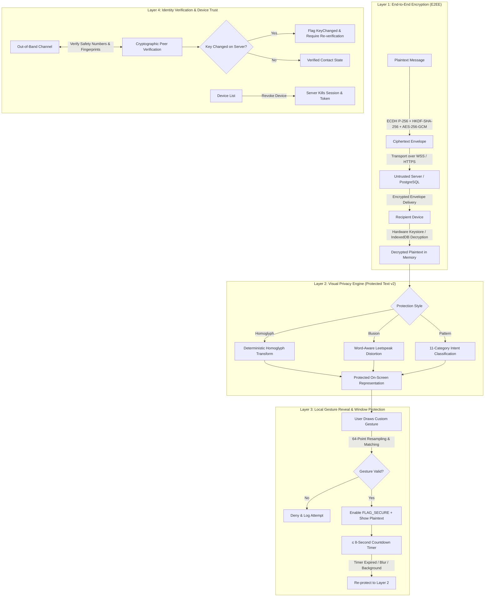
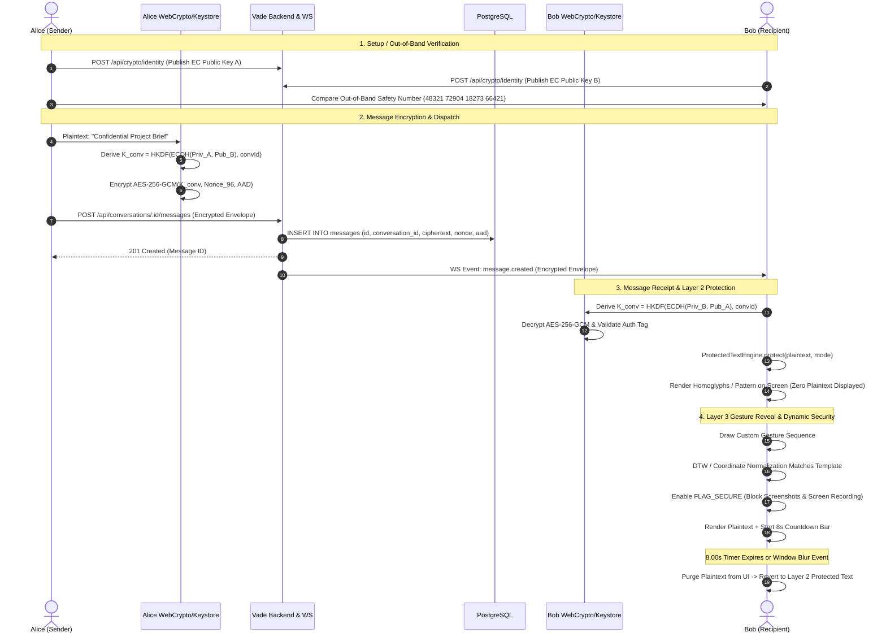

# Vade (ENCTXT) System Architecture & Features Specification

> **Document Version**: `1.0.0-rc.1`  
> **Target Release**: Production Ready (Web SPA & Android Native Client)  
> **Status**: AUTHORITATIVE & ARCHITECTURE BASELINE  
> **Security Model**: 4-Layer Defense-in-Depth Privacy Model  

---

## 1. Executive Overview & Core Philosophy

**Vade** (originally *ENCTXT*) is a high-security, privacy-first private text messaging platform built to withstand adversarial environments across network, database, and physical/visual threat vectors.

Unlike conventional secure messaging platforms that stop at transport or end-to-end encryption (E2EE), Vade introduces a **4-Layer Defense-in-Depth Privacy Model** that protects communication from physical shoulder-surfing, unauthorized on-device visual inspection, screen capture, untrusted database operators, and network eavesdropping.

```text
┌─────────────────────────────────────────────────────────────────────────┐
│                      4-LAYER DEFENSE-IN-DEPTH MODEL                     │
├─────────────────────────────────────────────────────────────────────────┤
│ Layer 4 │ Identity Verification & Device Trust                          │
│         │ • SHA-256 Fingerprints • Symmetric Safety Numbers             │
│         │ • Fail-Closed Key Change Alerts • Remote Device Revocation    │
├─────────┼───────────────────────────────────────────────────────────────┤
│ Layer 3 │ Local Gesture Reveal Authorization & Window Protection        │
│         │ • Multi-Stroke Geometric Gesture Recognition (DTW / 64-point) │
│         │ • ≤ 8-Second Plaintext Reveal Timer • Dynamic FLAG_SECURE     │
├─────────┼───────────────────────────────────────────────────────────────┤
│ Layer 2 │ Visual Privacy & Protected Message Rendering                  │
│         │ • Zero Plaintext Display by Default (Homoglyphs/Illusion/Pat) │
│         │ • Word-Aware Partial Distortion • Coarse Intent Category      │
├─────────┼───────────────────────────────────────────────────────────────┤
│ Layer 1 │ End-to-End Encryption (E2EE)                                  │
│         │ • ECDH NIST P-256 • HKDF-SHA-256 • AES-256-GCM with AAD       │
│         │ • Hardware-Isolated Keystore / IndexedDB Non-Extractable Keys │
└─────────────────────────────────────────────────────────────────────────┘
```

### Core Architecture Invariants
1. **Zero Server Plaintext**: The backend server and PostgreSQL database store and route *only* ciphertext envelopes and cryptographic metadata. Plaintext never enters server memory, logs, or disk.
2. **Zero Plaintext on Screen by Default**: Messages decrypt locally into memory but render as visual homoglyphs or protected patterns across message streams and conversation previews until explicit user authorization.
3. **Strict Ephemeral Plaintext Lifespan**: Once authorized via custom gesture, messages reveal for at most 8 seconds with an active visual countdown before automatically reverting to protected form.
4. **Immediate Fail-Closed Re-Protection**: Plaintext is instantly purged from display upon window blur, application backgrounding (`ON_STOP`), tab switching, or lock events.
5. **Non-Silent Key Trust**: Cryptographic public key rotations immediately flag contacts as `KeyChanged`, requiring explicit out-of-band re-verification before blind trust.

---

## 2. 4-Layer Defense-in-Depth Privacy Model



---

### Layer 1: End-to-End Cryptographic Security (E2EE)

All message payloads are encrypted directly on the sending device before network transmission and decrypted strictly in memory on the receiving device.

#### Cryptographic Primitives & Parameters
* **Key Agreement**: Elliptic Curve Diffie-Hellman (ECDH) on NIST Curve P-256 (`secp256r1` / `prime256v1`).
* **Key Derivation Function (KDF)**: HKDF (RFC 5869) with HMAC-SHA-256.
  * `Salt` = `${conversationId}`
  * `Info` = `"enctxt-v1-e2ee"`
  * `Key Length` = 256 bits (32 bytes)
* **Authenticated Encryption**: AES-256-GCM (NIST SP 800-38D).
  * `Key` = Derived 256-bit Conversation Key
  * `IV / Nonce` = 96-bit (12-byte) Cryptographically Secure Pseudo-Random Number (CSPRNG) generated uniquely per message
  * `Auth Tag` = 128-bit (16-byte) Galois authentication tag
* **Context Binding (AAD)**: Authenticated Associated Data formatted as UTF-8 string:
  $$\text{AAD} = \texttt{\$\{conversationId\}:\$\{senderId\}:v1}$$
  *Cryptographically binds every ciphertext to its unique conversation, author, and protocol version, preventing replay or splicing attacks across rooms or senders.*

#### Key Lifecycle & Storage Architecture
* **Web Client**: Private keys are generated using the Web Crypto API (`generateKey({ name: "ECDH", namedCurve: "P-256" }, false, ["deriveKey", "deriveBits"])`). Keys are stored **non-extractably** inside browser `IndexedDB` (`enctxt_crypto_keys`).
* **Android Native Client**: Private keys are generated and retained directly in the hardware-backed `AndroidKeyStore` with `KeyProperties.PURPOSE_AGREE_KEY`. Key material is strictly non-exportable from secure hardware (TEE / StrongBox).

#### Wire Envelope Structure (`EncryptedMessageEnvelope`)
```json
{
  "version": 1,
  "algorithm": "AES-256-GCM",
  "keyAgreement": "ECDH-P256",
  "senderKeyId": "k_e0f0a460d44c40968a7f7ed2ee3b5fd2",
  "recipientKeyId": "k_0e736526c27640a7bd91082eb5780a06",
  "nonce": "dGhpcyBpcyBhIDEyLWJ5dGUgbm9uY2U=",
  "ciphertext": "Y2lwaGVydGV4dCB3aXRoIDE2LWJ5dGUgZ2NtIHRhZw==",
  "aad": "Y29udGV4dF9hYWRfc3RyaW5n"
}
```

---

### Layer 2: Visual Privacy Engine (Protected Text v2)

Protected Text v2 is a local, deterministic, presentation-layer transform applied to decrypted messages in memory before rendering. It guarantees that someone looking over a user's shoulder cannot read active chat logs or preview notifications.

#### Protection Modes

| Mode | Visual Mechanism | Privacy Level | User Comprehensibility |
|---|---|---|---|
| **Homoglyph (Classic)** | Deterministic 1-to-1 Unicode lookalike substitution table. | High | Looks like ciphertext / foreign glyphs. |
| **Illusion** | Word-aware partial leetspeak distortion (20–45% character modification) seeded by message hash. | Medium | Readable up close by sender; illegible at a distance/angle. |
| **Pattern** | Coarse 11-category intent classification with decorative tokens. | Maximum | Conceals all content; reveals only message intent (e.g. `Question`, `Urgent`). |

```text
[Plaintext]: "Are you coming to the station tonight?"

[Homoglyph Mode]: "Αrе уοu сοmіng tο thе ѕtаtіοn tοnіght?"
[Illusion Mode]:   "Ar3 γ0u c0m!ηg to th€ 57a7ion toηi9ħτ?"
[Pattern Mode]:    "✦ PPP · ? · 7Xk"  (Intent: QUESTION)
```

#### Pattern Mode Intent Classifier
Pattern Mode runs a fast, synchronous, deterministic first-match-wins keyword and syntax heuristic locally on the client:

1. **URGENT** (`‼`): Contains `urgent`, `emergency`, `asap`, `immediately`, `help me`, or $2+$ exclamation marks.
2. **QUESTION** (`?`): Ends with `?`, or begins with interrogatives (`who`, `what`, `when`, `where`, `why`, `how`, `is`, `are`, `can`, `could`, `will`).
3. **GREETING** (`~`): Begins with greetings (`hello`, `hi`, `hey`, `good morning`, `yo`, `hola`).
4. **TIME** (`○`): Contains time/date tokens (`today`, `tomorrow`, `tonight`, `morning`, `noon`, `midnight`, `\d{1,2}(:\d{2})?\s?(am|pm)`).
5. **LOCATION** (`⟐`): Contains location tokens (`station`, `airport`, `address`, `office`, `street`, `building`, `restaurant`, `meet me at`).
6. **REQUEST** (`→`): Contains request phrases (`please`, `can you`, `could you`, `send me`, `help me with`).
7. **NEGATION** (`-`): Whole-word matches for `not`, `never`, `no`, `nope`, `can't`, `won't`, `don't`.
8. **AFFIRMATION** (`+`): Matches `yes`, `yeah`, `yep`, `sure`, `affirmative`, `agreed`, `absolutely`.
9. **FAREWELL** (`»`): Matches `bye`, `goodbye`, `see you`, `take care`, `farewell`.
10. **ACKNOWLEDGEMENT** (`✓`): Matches `got it`, `noted`, `understood`, `roger`, `thanks`, `thank you`, `ok`, `okay`.
11. **GENERAL** (`•`): Default fallback when no specific category triggers.

#### Privacy & Failure Guarantees
* **Fail-Closed**: Any rendering error falls back to displaying `⚠️ Unable to display protected message`—never unencrypted plaintext.
* **Transient State**: Protection style is a local preference (`localStorage` on Web, `SharedPreferences` on Android) and is never transmitted to the server.
* **Screen Reader Accessibility**: Assistive tech reads the current on-screen state (protected string when locked, plaintext during active reveal).

---

### Layer 3: Gesture Authorization & Window Protection

Plaintext is unlocked on a per-message or per-session basis via a custom multi-stroke geometric gesture.

```text
               User Draws Gesture on Touch Screen / Trackpad
                                     │
                                     ▼
                64-Point Arc-Length Normalization & Resampling
                                     │
                                     ▼
            Dynamic Time Warping (DTW) / Resampled Euclidean Metric
                                     │
                                     ▼
                 Match Distance ≤ Dynamic Strictness Threshold?
                                     │
                      ┌──────────────┴──────────────┐
                      ▼                             ▼
                  [ SUCCESS ]                   [ FAILURE ]
           • Enable Dynamic FLAG_SECURE      • Increment fail counter
           • Render Plaintext                • Shake canvas / error haptic
           • Start ≤ 8-Second Countdown      • Trigger lockout after 5 fails
                      │
                      ▼
           [ AUTO RE-PROTECT TRIGGERS ]
           • Timer reaches 0.00s
           • Window blur / focus loss (`blur`)
           • Activity `ON_STOP` / backgrounded
           • Tab navigation / route change
           • Lock button pressed
```

#### Window Security & Capture Prevention
* **Android Native Client (`FLAG_SECURE`)**: The Android Activity dynamically toggles `WindowManager.LayoutParams.FLAG_SECURE` during gesture entry and throughout active plaintext reveal. This blocks:
  * Hardware screenshots (Volume Down + Power)
  * System screen recording / casting
  * App switcher preview snapshots in the OS Recent Apps carousel
* **Web Client (Focus Obfuscation)**: Dynamic window blur detection immediately blanks the canvas and returns message elements to homoglyph display whenever window focus is lost.

---

### Layer 4: Identity Verification & Device Trust

Protects against Man-in-the-Middle (MITM) attacks and rogue server key substitution.

#### Out-of-Band Identity Verification
1. **Public Key Fingerprints**: Formatted as 8 groups of 4 uppercase hex characters derived from $\text{SHA-256}(\text{SPKI Public Key})$:
   ```text
   A7D4  92F1  8C20  4E73  B159  3D08  F62A  E941
   ```
2. **Symmetric Safety Numbers**: Deterministic 20-digit numeric codes generated by sorting peer IDs lexicographically, hashing combined public keys, and formatting into 4 blocks of 5 digits:
   ```text
   48321   72904   18273   66421
   ```
   *Both participants compute the exact same 20 digits regardless of who initiated the calculation.*

#### Key-Change Alerting Lifecycle
* When a user changes their device or rotates keys, the server updates their public key record.
* Upon detecting a key mismatch against locally stored verification records, the client immediately switches the contact status to **`KeyChanged`**.
* The UI displays a warning banner, marks historical verification as untrusted, and blocks unverified messaging until the user explicitly re-verifies the safety number.

#### Authoritative Device Management
* Authenticated endpoints allow users to list all active logged-in devices:
  `GET /api/devices`
* Users can remotely revoke any compromised or lost device:
  `POST /api/devices/:id/revoke`
* Revoking a device instantly invalidates its session JWT and WebSocket subscriptions.

---

## 3. High-Level System Architecture & Topology

```text
                                     INTERNET
                                        │
                                        ▼ (HTTPS / WSS - Port 443)
                         ┌─────────────────────────────┐
                         │   Reverse Proxy / TLS Edge  │
                         │   (Nginx / Caddy TLS 1.3)   │
                         └──────────────┬──────────────┘
                                        │
             ┌──────────────────────────┼──────────────────────────┐
             │                          │                          │
             ▼                          ▼                          ▼
   ┌───────────────────┐      ┌───────────────────┐      ┌───────────────────┐
   │  Web Static SPA   │      │ Node.js Backend   │      │ Native Android    │
   │  (React / Vite)   │      │ (Express + WSS)   │      │ (Kotlin/Compose)  │
   │  • Protected Text │      │ • REST Endpoints  │      │ • Android Keystore│
   │  • Gesture Engine │      │ • WS Broadcaster  │      │ • Room DB Cipher  │
   │  • WebCrypto API  │      │ • Rate Limiting   │      │ • FLAG_SECURE     │
   │  • IndexedDB Keys │      │ • Health Probes   │      │ • Offline Sync    │
   └───────────────────┘      └─────────┬─────────┘      └───────────────────┘
                                        │
                                        ▼
                             ┌─────────────────────┐
                             │ PostgreSQL Database │
                             │ • Ciphertext Envs   │
                             │ • User Accounts     │
                             │ • Public SPKI Keys  │
                             │ • Device Sessions   │
                             └─────────────────────┘
```

---

## 4. End-to-End Sequence: Message Transmission & Reveal



---

## 5. Component Breakdown & Internal Architecture

### 5.1 Backend Service (`server/`)

Built with **Node.js**, **Express**, **TypeScript**, and **ws** (WebSocket).

```text
server/src/
├── config/             # Database connection, CORS, JWT secrets, environment loading
├── controllers/        # Request handling and HTTP status mapping
│   ├── authController.ts         # User signup, login, session cookies, logout
│   ├── conversationController.ts # 1-to-1 conversation creation and listing
│   ├── cryptoController.ts       # Identity public key registration & retrieval
│   ├── deviceController.ts       # Device registration, listing, and revocation
│   ├── healthController.ts       # Liveness (/health) & Readiness (/health/ready)
│   ├── messageController.ts      # Ciphertext envelope persistence & pagination
│   └── userController.ts         # User profiles and autocomplete search
├── middleware/         # Security middleware
│   ├── auth.ts                   # HttpOnly JWT cookie session validation
│   ├── rateLimiter.ts            # Strict rate limits on auth and crypto endpoints
│   ├── validation.ts             # Input sanitization and schema assertion
│   └── errorHandler.ts           # Centralized fail-closed error responses
├── routes/             # Express route declarations (/api/*)
├── services/           # Business logic & external systems
│   ├── conversationService.ts    # Deterministic pair matching (min(A,B):max(A,B))
│   ├── cryptoService.ts          # Key registry validation & public key lifecycle
│   ├── deviceService.ts          # Device trust, session tracking, killswitch
│   ├── messageService.ts         # Message persistence and read receipt updates
│   ├── userService.ts            # User identity & profile operations
│   └── websocketService.ts       # Real-time room multiplexing, heartbeat, broadcast
├── types/              # Internal backend type definitions
└── server.ts           # HTTP + WebSocket server bootstrap & graceful shutdown
```

#### Key Backend Responsibilities
* **Zero-Plaintext Invariant**: Express routes validate payload structure (Base64 encoding, nonce length, algorithm name), persisting ciphertext blobs without inspecting contents.
* **Deterministic Direct Messaging**: Conversations are indexed by a unique deterministic direct key $\min(\text{userId}_A, \text{userId}_B) : \max(\text{userId}_A, \text{userId}_B)$, preventing duplicate 1-to-1 channels.
* **WebSocket Multiplexing**: Manages authenticated room subscriptions, connection keep-alives (30s ping/pong), delivery ACKs, and receipt events.
* **Graceful Degradation & Readiness**: Dedicated readiness probes verify PostgreSQL connectivity before traffic routing.

---

### 5.2 Web Client (`client/`)

Single Page Application (SPA) built with **React 18**, **TypeScript**, **Vite**, **Tailwind CSS**, and **Radix UI**.

```text
client/src/
├── auth/               # AuthContext, login/registration forms, session management
├── components/         # Reusable UI component library
│   ├── auth/           # Protected routes, session banners
│   ├── chat/           # MessageBubble, MessageInput, ConversationList, Timeline
│   ├── crypto/         # SafetyNumberModal, FingerprintCard, KeyChangedWarning
│   ├── gestures/       # GestureCanvas, GestureRecorder, GestureVerifierModal
│   ├── privacy/        # ProtectedMessage, ProtectionStyleSelector, CountdownBar
│   ├── settings/       # DeviceManager, ProfileSettings, SecuritySettings
│   └── ui/             # Radix primitives (Button, Dialog, Dropdown, Input, Toast)
├── crypto/             # Cryptographic engine
│   ├── e2ee.ts         # ECDH key agreement, HKDF derivation, AES-GCM encryption
│   ├── keyStore.ts     # Non-extractable IndexedDB keypair persistence
│   └── safetyNumbers.ts# Fingerprint and symmetric safety number generators
├── hooks/              # Custom React hooks
│   ├── useChat.ts      # WebSocket connection, room subscription, message state
│   ├── useGesture.ts   # Gesture recording, DTW distance comparison, lock timer
│   └── useVisibility.ts# Window blur/focus and page visibility change monitors
├── pages/              # Application views (ChatPage, LoginPage, SettingsPage)
├── services/           # REST API client and WebSocket client managers
├── theme/              # Theme configuration (Dark mode, visual tokens)
└── utils/              # Pure utilities
    └── protectedText/  # ProtectedTextEngine (Homoglyphs, Illusion, Pattern)
```

#### Key Web Client Responsibilities
* **WebCrypto Sandbox**: Keeps private keys unexportable inside browser memory and IndexedDB.
* **Reactive Privacy Engine**: Automatically intercepts all incoming message envelopes, decrypts them asynchronously, and converts them to protected representations before feeding the React component tree.
* **Gesture Interaction**: Multi-touch / mouse coordinate capture normalized into 64 equidistant points for real-time stroke recognition.

---

### 5.3 Android Native Client (`android/`)

Native Android client engineered with **Kotlin**, **Jetpack Compose**, **Room Database**, **Android Keystore**, and **OkHttp 4.x**.

```text
android/app/src/main/java/com/enctxt/
├── EnctxtApplication.kt           # App lifecycle & dependency initializers
├── MainActivity.kt                # Single-activity container with WindowFocusMonitor
├── core/
│   ├── gesture/                   # Gesture recognizer, 64-point resampler, DTW
│   ├── network/                   # OkHttp HTTPS client, WebSocket listener, CookieJar
│   ├── privacy/                   # ProtectedTextEngine, Homoglyphs, Illusion, Pattern
│   ├── security/                  # Keystore EC P-256 agreement, HKDF, AES-256-GCM
│   ├── storage/                   # EncryptedSharedPreferences for gestures & trust
│   └── sync/                      # Message sync engine, offline queue, retry backoff
├── data/
│   ├── local/                     # Room DB (ConversationEntity, MessageEntity)
│   ├── model/                     # Wire envelopes, domain models, WebSocket events
│   └── repository/                # ChatRepository, AuthRepository, CryptoRepository
└── presentation/
    ├── components/                # ProtectedMessage, GestureCanvas, CountdownTimer
    ├── theme/                     # Material 3 Design tokens
    └── viewmodel/                 # ChatViewModel, AuthViewModel, SettingsViewModel
```

#### Key Android Native Responsibilities
* **Hardware-Isolated Cryptography**: Utilizes `AndroidKeyStore` with ECDH `KeyAgreement`, ensuring private keys are physically isolated within the device's Secure Element / TEE.
* **Dynamic Window Protection**: Hooks `WindowFocusMonitor` and Compose state to toggle `FLAG_SECURE` strictly during gesture entry and temporary plaintext reveal.
* **Offline-First Resilience**: Room Database acts as the single source of truth for encrypted envelopes, queueing outgoing messages locally and synchronizing seamlessly upon network reconnection.

---

### 5.4 Shared Monorepo Package (`shared/`)

Shared TypeScript package providing cross-platform contracts between backend and web client:

* **Crypto Types**: `EncryptedMessageEnvelope`, `IdentityKeyPayload`, `KeyStatus`.
* **API Payloads**: Request/Response interfaces for Auth, Users, Conversations, Devices.
* **WebSocket Frames**: Complete union types for client/server frames (`WSClientMessage`, `WSServerMessage`).
* **Error Codes**: Unified error enumeration (`RESOURCE_ALREADY_EXISTS`, `VALIDATION_FAILED`, `AUTHENTICATION_FAILED`, `RATE_LIMITED`, `FORBIDDEN`, `INTERNAL_ERROR`).

---

## 6. Comprehensive Feature Matrix

### 6.1 Authentication & User Management

| Feature | Description | Platform Support | Security Mechanism |
|---|---|---|---|
| **Account Registration** | Username, email, password, and display name registration. | Web & Android | Rate-limited (5 req / 15m), Argon2/bcrypt password hashing. |
| **Secure Login** | Identifier + password login returning HttpOnly session cookies. | Web & Android | HttpOnly, Secure, SameSite=Lax JWT cookie (`enctxt_session`). |
| **Session Hydration** | Seamless session restore on app launch (`/api/auth/me`). | Web & Android | Cookie-based session verification with DB invalidation check. |
| **User Search** | Find peers by username or display name for direct chat. | Web & Android | Authenticated SQL search with query sanitization. |
| **Profile Management** | Update display names and preferences. | Web & Android | Authorized user endpoints (`PATCH /api/users/me`). |

---

### 6.2 1-to-1 End-to-End Encrypted Messaging

| Feature | Description | Platform Support | Security Mechanism |
|---|---|---|---|
| **Deterministic Conversations** | Automatically discovers or creates direct 1-to-1 chat pairs. | Web & Android | Indexed by `min(idA, idB):max(idA, idB)`. |
| **Zero-Plaintext Previews** | Conversation list shows participant metadata without message previews. | Web & Android | Server never possesses or generates plaintext snippet previews. |
| **Asynchronous E2EE Dispatch** | Local client encryption and atomic server persistence. | Web & Android | `AES-256-GCM` + `ECDH P-256` + `HKDF-SHA-256`. |
| **Real-Time WSS Delivery** | Instant sub-second delivery to active recipient WebSocket. | Web & Android | Authenticated WebSocket multiplexing and room broadcasting. |
| **Monotonic Delivery Receipts** | Real-time status progression: `Sending` $\to$ `Sent` $\to$ `Delivered` $\to$ `Read`. | Web & Android | Strict state progression guarantees, preventing receipt regression. |
| **Encrypted Message History** | Paginated retrieval of historical ciphertext envelopes. | Web & Android | Authenticated participant access only; local in-memory decryption. |
| **Offline Message Queueing** | Queue messages when disconnected; auto-dispatch when reconnected. | Android & Web | Optimistic local database staging with exponential backoff retry. |

---

### 6.3 Visual Privacy & Screen Defense (Layers 2 & 3)

| Feature | Description | Platform Support | Security Mechanism |
|---|---|---|---|
| **Protected Rendering (Homoglyph)** | Replaces text with deterministic unicode lookalikes. | Web & Android | Canonical character substitution table. |
| **Protected Rendering (Illusion)** | Word-aware leetspeak distortion (~20–45% characters changed). | Web & Android | Synchronous SHA-256 seeded deterministic replacement. |
| **Protected Rendering (Pattern)** | Hides message content; shows coarse 11-category intent token. | Web & Android | Deterministic local keyword classifier + decorative symbols. |
| **Protection Style Settings** | Per-user choice between Classic, Illusion, and Pattern styles. | Web & Android | Stored locally in `localStorage` / `SharedPreferences` only. |
| **Custom Gesture Recording** | Record a multi-stroke geometric gesture template. | Web & Android | 64-point arc-length normalization, encrypted local storage. |
| **Ephemeral Plaintext Reveal** | Draw gesture over message to reveal plaintext for $\le 8$s. | Web & Android | Dynamic Time Warping (DTW) matching + active countdown bar. |
| **Instant Auto Re-protection** | Automatically re-locks revealed messages on blur/backgrounding. | Web & Android | Monitored on `blur`, `visibilitychange`, and Activity `ON_STOP`. |
| **Dynamic Window Shielding** | Blocks screenshots, screen recorders, and app switcher previews. | Android Native | `FLAG_SECURE` enabled during gesture entry and reveal window. |
| **Screen Reader Privacy** | Accessible announcements align with visible state. | Web & Android | Reads protected string when locked; plaintext only during reveal. |

---

### 6.4 Cryptographic Identity & Device Trust (Layer 4)

| Feature | Description | Platform Support | Security Mechanism |
|---|---|---|---|
| **Identity Key Generation** | Generates non-extractable ECDH P-256 keypairs. | Web & Android | Hardware `AndroidKeyStore` / WebCrypto non-extractable keys. |
| **Public Key Publishing** | Publishes SPKI Base64 public keys to server key registry. | Web & Android | Cryptographic binding to authenticated user profile. |
| **SHA-256 Fingerprints** | Displays 32-character hex identity fingerprint for manual check. | Web & Android | Computed from `SHA-256(SPKI_DER)` formatted in 8 groups of 4. |
| **Symmetric Safety Numbers** | Generates identical 20-digit verification codes for both peers. | Web & Android | Lexicographically sorted peer hashing (4 blocks of 5 digits). |
| **Key-Change Detection** | Detects peer public key rotations and transitions to `KeyChanged`. | Web & Android | Replaces trust badge with prominent warning; halts blind trust. |
| **Explicit Re-verification** | Re-verify contacts out-of-band following key rotation. | Web & Android | User confirmation updates local encrypted verification store. |
| **Device Registration** | Registers platform, device name, and public key on login. | Web & Android | Authoritative server device session tracking. |
| **Active Device Audit** | Inspect all devices logged into the user's account. | Web & Android | Authenticated device listing endpoint (`GET /api/devices`). |
| **Remote Device Revocation** | Instantly terminate session and access for any registered device. | Web & Android | Server-enforced session revocation (`POST /api/devices/:id/revoke`). |

---

### 6.5 Operations, Reliability & Infrastructure

| Feature | Description | Details |
|---|---|---|
| **Liveness & Readiness Probes** | Automated health checks for orchestrators (Docker / K8s). | `/api/health` (uptime, version) & `/api/health/ready` (DB ping). |
| **Reverse Proxy Hardening** | Nginx / Caddy configurations with TLS 1.3 and security headers. | HSTS, Content-Security-Policy, X-Frame-Options, X-Content-Type-Options. |
| **Encrypted Database Backups** | Automated disaster recovery backup and restore scripts. | `pg_dump` piped directly through `openssl enc -aes-256-cbc`. |
| **Comprehensive Test Suite** | 165 Web & Backend tests + 304 Android test executions. | Cross-platform test vectors verify identical cryptographic & rendering output. |

---

## 7. REST API & WebSocket Protocol Reference

### 7.1 REST API Endpoint Summary

```text
AUTHENTICATION (/api/auth)
├── POST   /api/auth/register          # Register new user account (Rate limited)
├── POST   /api/auth/login             # Authenticate & set HttpOnly session cookie
├── GET    /api/auth/me                # Hydrate current user session
└── POST   /api/auth/logout            # Invalidate session & clear cookies

USER PROFILES (/api/users)
├── GET    /api/users/me               # Fetch current user profile
├── PATCH  /api/users/me               # Update profile details
└── GET    /api/users/search?q=:query  # Search users for conversation initiation

CONVERSATIONS (/api/conversations)
├── POST   /api/conversations          # Get or create 1-to-1 conversation
├── GET    /api/conversations          # List user conversations (Zero-plaintext previews)
├── GET    /api/conversations/:id      # Get conversation details
├── POST   /api/conversations/:id/read # Mark conversation messages as read
├── POST   /api/conversations/:id/messages # Send encrypted ciphertext envelope
└── GET    /api/conversations/:id/messages # Paginated encrypted message history

CRYPTOGRAPHIC IDENTITY (/api/crypto)
├── POST   /api/crypto/identity        # Publish / rotate ECDH identity public key
└── GET    /api/crypto/users/:userId/key # Retrieve peer's active public key

DEVICE MANAGEMENT (/api/devices)
├── GET    /api/devices                # Enumerate active devices for current account
├── POST   /api/devices/register       # Register active device name and keyId
└── POST   /api/devices/:id/revoke     # Remotely revoke device session

SYSTEM HEALTH (/api/health)
├── GET    /api/health                 # Liveness probe (Status, uptime, version)
└── GET    /api/health/ready           # Readiness probe (Database connectivity check)
```

---

### 7.2 WebSocket Protocol Contract (`/ws`)

* **Handshake**: Initiated over HTTPS upgrade with `enctxt_session` cookie authentication.
* **Heartbeat**: 30-second ping/pong keep-alive interval.

```text
CLIENT -> SERVER FRAMES (WSClientMessage)
├── { "type": "ping" }
├── { "type": "auth", "token": "<jwt>" }
├── { "type": "subscribe", "conversationId": "<uuid>" }
├── { "type": "unsubscribe", "conversationId": "<uuid>" }
├── { "type": "message.delivered", "conversationId": "<uuid>", "messageId": "<uuid>" }
└── { "type": "message.read", "conversationId": "<uuid>", "messageId": "<uuid>" }

SERVER -> CLIENT FRAMES (WSServerMessage)
├── { "type": "pong" }
├── { "type": "authenticated", "userId": "<uuid>" }
├── { "type": "subscribed", "conversationId": "<uuid>" }
├── { "type": "unsubscribed", "conversationId": "<uuid>" }
├── { "type": "message.created", "conversationId": "<uuid>", "message": { <EncryptedEnvelope> } }
├── { "type": "message.delivered", "conversationId": "<uuid>", "messageId": "<uuid>", "deliveredAt": "..." }
├── { "type": "message.read", "conversationId": "<uuid>", "messageId": "<uuid>", "readAt": "...", "readBy": "..." }
└── { "type": "error", "message": "...", "code": "FORBIDDEN | VALIDATION_FAILED | RATE_LIMITED" }
```

---

## 8. Threat Model & Security Boundaries

### 8.1 Defended Threat Vectors

| Threat Vector | Defense Mechanism | System Guarantee |
|---|---|---|
| **Database Compromise** | Layer 1 (Client-Side E2EE) | PostgreSQL stores only ciphertext envelopes with fresh 96-bit nonces. Attackers with raw SQL access read zero plaintext. |
| **Network Eavesdropping** | HTTPS/TLS 1.3 + E2EE | Dual-layer encryption prevents ISP, cellular carrier, proxy, or rogue Wi-Fi interception. |
| **Malicious Server / MITM** | Layer 4 (Identity Verification) | Users verify public key fingerprints and symmetric safety numbers out-of-band to detect key tampering. |
| **Key Substitution Attacks** | Layer 4 (Key-Change Detection) | Any server public key change transitions contact state to `KeyChanged`. Never silently re-verifies. |
| **Rogue / Stolen Devices** | Layer 4 (Device Trust) | Authoritative device listing and server-enforced remote revocation (`POST /api/devices/:id/revoke`). |
| **Shoulder Surfing** | Layer 2 (Protected Rendering) | Messages render as visual homoglyphs or patterns on screen by default across timelines and previews. |
| **Unauthorized Physical Screen Glance** | Layer 3 (Gesture Reveal) | Plaintext is temporarily revealed for only $\le 8$ seconds upon valid local gesture authorization. |
| **Background / App Switching Leaks** | Layer 3 (Auto Re-Protection) | Plaintexts immediately re-protect on `ON_STOP`, window blur, tab switch, navigation away, or lockout. |
| **Screen Capture & Recents Leaks** | Layer 3 (FLAG_SECURE) | Android window dynamically enables `FLAG_SECURE` during reveal, blocking screenshots, screen recording, and recent-app previews. |
| **Device Key Extraction** | Android Keystore | Private EC keys are generated and protected hardware-backed in Android Keystore with `PURPOSE_AGREE_KEY`. |
| **Gesture Template Theft** | Encrypted Local Storage | Stored gesture templates use AES-256-GCM encrypted local storage with fail-closed deserialization. |

---

### 8.2 Explicit Non-Protections & Out-of-Scope Boundaries

To maintain cryptographic and architectural honesty, Vade explicitly documents the limits of its security model:

1. **Compromised Operating Systems & Kernel Rootkits**: If an adversary possesses root/kernel-level execution on a client device, they can inspect memory directly.
2. **Hardware Keyloggers**: Keystrokes intercepted before client-side encryption cannot be defended against by E2EE.
3. **Malicious Accessibility Services**: Sideloaded malicious Android apps with accessibility scraping permissions can read UI tree nodes during an active reveal.
4. **Optical / External Camera Recording**: Physical cameras aimed at the screen during an authorized $\le 8$-second reveal window cannot be blocked by software flags.
5. **Recipient Exfiltration**: A verified recipient can manually copy, photograph, or dictate revealed content.
6. **Double Ratchet / Post-Quantum (Protocol v1)**: Protocol v1 uses static-ephemeral ECDH P-256. It does not implement per-message Signal Double Ratchet forward secrecy or post-quantum lattice primitives.

---

## 9. Verification, Test Vectors & Build Validation

Both Web and Android clients independently test against unified, frozen test vectors located in `docs/test-vectors/`:

* `crypto-test-vectors.json`: Cross-platform verification of P-256 ECDH, HKDF-SHA-256, and AES-256-GCM ciphertext output.
* `protected-text-v2-test-vectors.json`: 23 test categories across 3 protection modes verifying byte-for-byte visual equivalence between TypeScript and Kotlin rendering engines.

### Execution Commands

```bash
# Web & Server Test Suites (165 tests)
npm test

# Full TypeScript Monorepo Typecheck & Production Build
npm run typecheck
npm run build

# Android Native Unit Test Executions (304 tests across debug/release)
cd android
./gradlew test

# Android Static Analysis & Release Bundles
./gradlew lint
./gradlew assembleRelease bundleRelease
```

---

## 10. Summary Reference

| Property | Value / Specification |
|---|---|
| **System Name** | Vade (ENCTXT) |
| **Release Candidate** | `v1.0.0-rc.1` |
| **Protocol Version** | Protocol `v1` |
| **Renderer Version** | `PROTECTED_RENDERER_VERSION = 2` |
| **Web Tech Stack** | React 18, TypeScript, Vite, Tailwind CSS, WebCrypto API, IndexedDB |
| **Android Tech Stack** | Kotlin, Jetpack Compose, Android Keystore, Room, OkHttp 4.x |
| **Backend Tech Stack** | Node.js, Express, TypeScript, WebSocket (`ws`), PostgreSQL |
| **Key Agreement** | ECDH NIST Curve P-256 (`secp256r1`) |
| **Symmetric Cipher** | AES-256-GCM with 96-bit CSPRNG IV & 128-bit Auth Tag |
| **KDF** | HKDF-SHA-256 (RFC 5869), Salt=`conversationId`, Info=`"enctxt-v1-e2ee"` |
| **Context Binding (AAD)**| `${conversationId}:${senderId}:v1` |
| **Visual Privacy Engine**| Protected Text v2 (Homoglyph, Illusion, Pattern with 11-category intent classifier) |
| **Reveal Authorization** | 64-point Arc-Length Normalized Multi-Stroke Gesture + $\le 8$s Expiry |
| **Window Defense** | Dynamic `FLAG_SECURE` (Android) + Focus Blur Purge (Web) |
| **Identity Verification**| SHA-256 SPKI Fingerprints + 20-digit Lexicographical Safety Numbers |
| **Device Management** | Server-authoritative multi-device registry with remote revocation |
